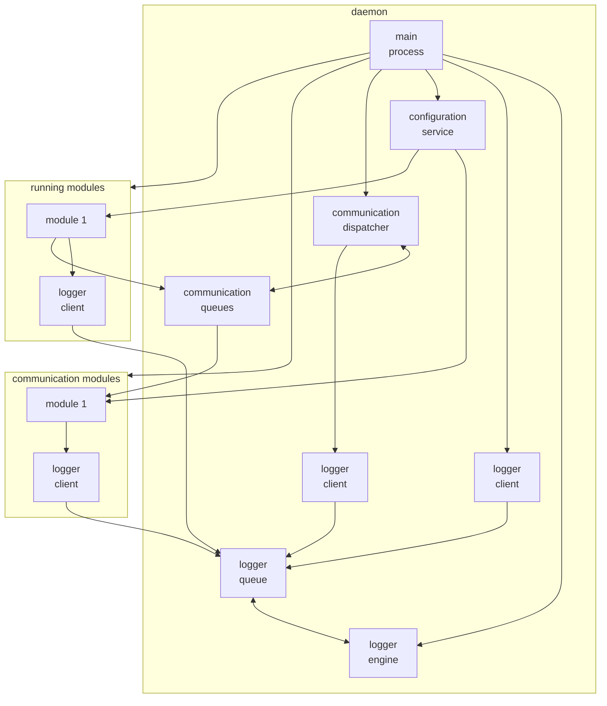

# AASd

Autonomous Administrative System daemon.

## Purpose

The main goal of the project is to create a modular platform supporting UNIX system administration tasks in the field of monitoring environmental parameters and process status as well as responding to incidents. However, due to the assumed architecture of the platform, there is a lot of freedom in creating the functionalities of working modules.

The platform integrates two types of modules: intended for communication with the platform user: 'modules.com' and intended for performing tasks: 'modules.run'.

Modules are loaded dynamically based on rules defined in the main section of the configuration file.

Each module is launched in a separate thread and is executed independently of the other modules of the platform, according to the rules specified in its configuration section.

## Flow diagram

