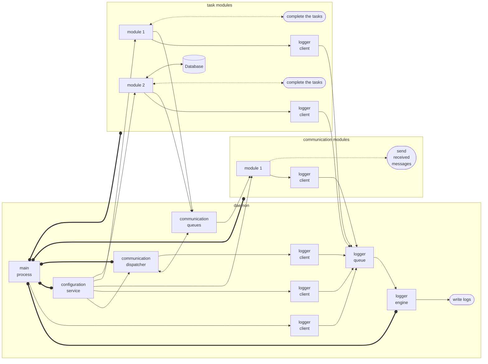

# Flow diagram

```mermaid
flowchart LR
    subgraph main [daemon]
    A1[main\nprocess] o==o A2[logger\nengine]
    LQ[logger\nqueue] --> A2
    A1 --> A3[logger\nclient]
    A3 --> LQ
    A1 o==o CONF[configuration\nservice]
    A1 o==o A5[communication\ndispatcher]
    A5 <--> CQ[communication\nqueues]
    A5 --> A7[logger\nclient]
    A7 --> LQ
    CONF --> A5
    CONF --> A8[logger\nclient]
    A8 --> LQ
    A2 ---> WL([write logs])
    end
    A1 o==o com
    A1 o==o run
    subgraph com [communication modules]
    C1[module 1] --> C2[logger\nclient]
    CONF --> C1
    C2 --> LQ
    CQ --> C1
    C1 -...-> CE(["send\nreceived\nmessages"])
    end
    subgraph run [task modules]
    R1[module 1] --> R2[logger\nclient]
    CONF --> R1
    R2 --> LQ
    R1 --> CQ
    R1 <-...-> RE1(["complete the tasks"])
    R3[module 2] --> R4[logger\nclient]
    CONF --> R3
    R4 --> LQ
    R3 --> CQ
    R3 <-...-> RE3(["complete the tasks"])
    R3 <--> R5[(Database)]
    end
```
